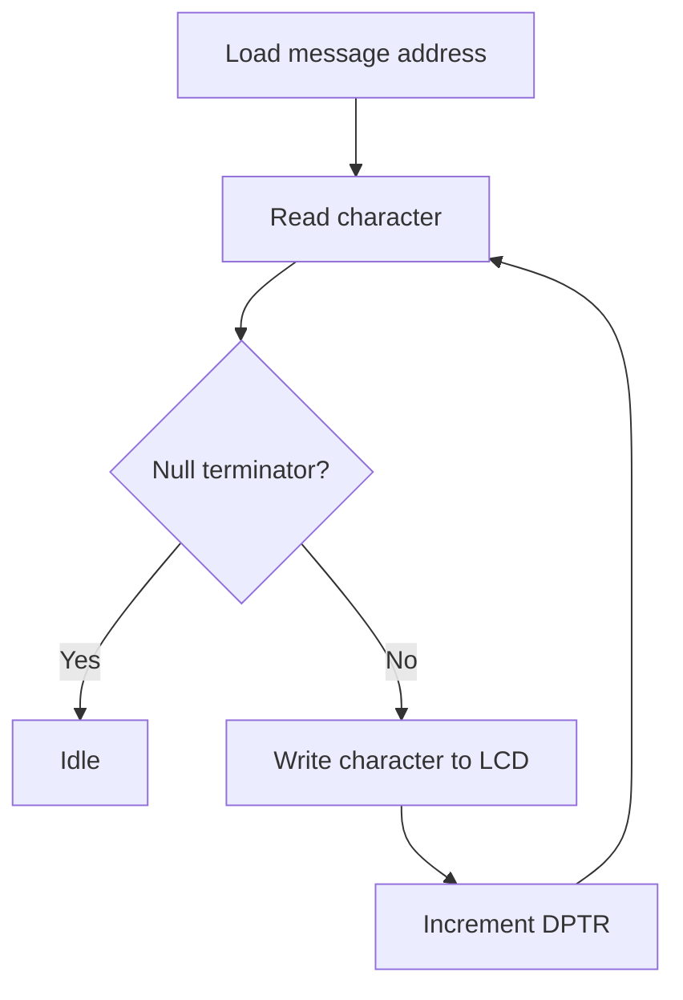

# Program Control Flow

[Back to project](README.md)

```mermaid
flowchart TD
A["Load message address"] --> B["Read character"]
B --> C{"Null terminator?"}
C -->|Yes| D["Idle"]
C -->|No| E["Write character to LCD"]
E --> F["Increment DPTR"]
F --> B
```
